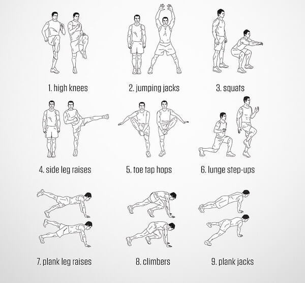

# Hướng dẫn chi tiết các bài tập HIIT đốt mỡ toàn thân hiệu quả cho nam và nữ

Trước khi bắt đầu, bạn cần phải nắm vững nguyên tắc ở trên nhé. Ngoài ra, bạn cần phải tập hết sức mình để đốt cháy được càng nhiều mỡ càng tốt. Dưới đây là lịch trình tập HIIT đốt mỡ giảm cân trong 30 ngày.

## Ngày 01

- Cấp độ 1: 5 vòng
- Cấp độ 2: 10 vòng
- Cấp độ 3: 15 vòng
- 1 phút nghỉ giữa các vòng
- Thực hiện 20 giây cho mỗi động tác, càng nhanh càng tốt

### Cách thực hiện

1. **Bài tập _High Knees_ chạy tại chỗ, nâng cao đùi**: Chạy tại chỗ, nâng đùi cao hơn hông. Kết hợp đánh tay để đốt mỡ nhiều hơn.
2. **Bài tập _Squat_**: Đứng thẳng, 2 chân bằng vai, mắt nhìn về trước. Hạ người xuống cho tới khi nào đùi song song với sàn. Đẩy người đứng dậy.
3. **Bài tập _Burpees_**: Đứng thẳng, 2 chân bằng vai. Hạ người xuống sàn, chống 2 tay bằng vai, đẩy 2 chân về phía sau vào tư thế hít đất. Thực hiện 1 cái. Nhảy 2 chân về phía 2 tay và đứng dậy.

## Ngày 02

- Cấp độ 1: 3 vòng
- Cấp độ 2: 4 vòng
- Cấp độ 3: 5 vòng

### Cách thực hiện

_1._ **Bài tập _Plank_ cùi chỏ:** Vào tư thế như hình, hai chân có thể bằng hông hoặc chạm nhau, 2 tay bằng vai. Người thẳng.

2. Một vòng gồm 4 lần lặp:

- Tập 10 giây và nghỉ 20 giây;
- Tập 20 giây và nghỉ 20 giây;
- Tập 10 giây và nghỉ 20 giây;
- Tập 20 giây và nghỉ 60 giây.

## Ngày 03

- Tập mỗi bài 1 phút.
- Nghỉ 1 phút giữa các bài.
- Tập càng nhanh càng tốt.

### Cách thực hiện

1. **Bài tập chạy nâng cao đùi**: Cách thực hiện như trên.

2. **Bài tập _Jumping Jacks_**: Đứng thẳng người, hai tay duỗi thẳng 2 bên đùi. Nhảy mạnh lên, vòng 2 tay qua đầu. Tiếp đất bằng 2 chân dang rộng, nhảy về.

3. **Bài tập _Squat_**: Cách thực hiện như trên.
4. **Bài tập _Side Leg Raises_**: Đứng thẳng người, nâng từng chân lần lượt sang từng bên.

5. **Bài tập _Toes Tap Hops_**: Bạn cần phải nhảy đổi bên, tay phải chạm vào lòng trong bàn chân trái và ngược lại.

6. **Bài tập _Lunge Step-Ups_**: Đứng thẳng người, bước chân phải lên, chân trái ở sau. Hạ người xuống cho tới khi nào đùi phải song song với sàn. Quay trở về vị trí cũ và lặp lại cho chân kia.

7. **Bài tập _Plank_ nâng 1 chân**: Vào tư thế _Plank_ thẳng tay, nâng từng chân lên càng cao càng tốt. Đổi chân liên tục.

8. **Bài tập leo núi**: Vào tư thế Plank thẳng tay, lần lượt kéo từng gối về phía ngực. Thực hiện càng nhanh càng tốt.

9. **Bài tập _Plank Jacks_**: Vào tư thế Plank thẳng tay, hai chân bằng hông. Nhảy mạnh 2 chân ra 2 bên và nhảy về.

## Ngày 04

- Cấp độ 1: 3 vòng
- Cấp độ 2: 4 vòng
- Cấp độ 3: 5 vòng
- **Bài tập _Burpees_**: Cách thực hiện như trên
- Một vòng gồm 4 lần lặp:
  - Tập 10 giây và nghỉ 20 giây;
  - Tập 20 giây và nghỉ 20 giây;
  - Tập 10 giây và nghỉ 20 giây;
  - Tập 20 giây và nghỉ 60 giây.

## Ngày 05

- Cấp độ 1: 5 vòng
- Cấp độ 2: 10 vòng
- Cấp độ 3: 15 vòng
- 1 phút nghỉ giữa các vòng

### Cách thực hiện

1. **Bài tập Plank Jacks**: Cách thực hiện như trên
2. **Bài tập Plank nâng 1 chân**: Cách thực hiện như trên
3. **Bài tập Plank nâng tay**: Vào tư thế Plank thẳng tay, lần lượt nâng từng tay về phía trước. Lặp lại càng nhanh càng tốt.
4. **Bài tập leo núi**: Cách thực hiện như trên

## Ngày 06

- Cấp độ 1: 5 vòng
- Cấp độ 2: 10 vòng
- Cấp độ 3: 15 vòng
- **Bài tập chạy nâng cao đùi**: Cách thực hiện như trên
- Một vòng gồm 2 lần:
  - Tập 30 giây và nghỉ 30 giây;
  - Tập 30 giây và nghỉ 60 giây.

## Ngày 07

- Cấp độ 1: 3 vòng
- Cấp độ 2: 4 vòng
- Cấp độ 3: 5 vòng
- 1 phút nghỉ giữa các bài.
- Tập càng nhanh càng tốt.

### Cách thực hiện

1. **Bài tập Crunches**: Nằm ngửa lưng trên sàn, hai chân đặt trên sàn hoặc móc vào 1 vị trí cố định, hai tay đặt sau đầu. Dùng lực cơ bụng cuộn người lên.
2. **Bài tập Reverse Crunches**: Nằm thẳng người trên sàn, 2 lòng bàn tay úp xuống, dọc theo người. Dùng lực cơ bụng cuộn 2 gối lên về phía ngực.
3. **Bài tập Flutter Kicks**: Nằm ngửa người trên sàn, hai lòng bàn tay úp xuống, dọc theo người. Từ từ đá từng chân lên, chân ở dưới không được chạm sàn.
4. **Bài tập cái kéo**: Nằm ngửa trên sàn, 2 lòng bàn tay úp xuống, dọc theo người. Đá 2 chân chéo nhau.

## Ngày 08

- Cấp độ 1: 5 vòng
- Cấp độ 2: 10 vòng
- Cấp độ 3: 15 vòng
- 1 phút nghỉ giữa các bài
- Thực hiện càng nhanh càng tốt.

### Cách thực hiện

1. **Bài tập Half Jacks**: Đứng thẳng người. Nhảy 2 chân ra 2 bên và nhảy về.
2. **Bài tập nhảy sang 2 bên**: Hạ người vào tư thế chuẩn bị chạy, nhảy sang bên phải, chân trái co lại, đánh 2 tay sang phải. Đổi bên.
3. **Bài tập nâng tay xoay tròn**: Đứng thẳng người, hai chân bằng hông, nâng 2 tay lên ngang vai. Xoay tròn và đổi hướng.

## Ngày 09

- Cấp độ 1: 1 vòng
- Cấp độ 2: 2 vòng
- Cấp độ 3: 3 vòng
- Tập liên tục các động tác và nghỉ 2 phút cho vòng tiếp theo.

### Cách thực hiện

1. Bài tập Plank thẳng tay: 10 giây
2. Bài tập Plank cùi chỏ: 10 giây
3. Bài tập Plank 1 tay: 10 giây/tay
4. Bài tập Plank cùi chỏ: 10 giây
5. Bài tập Plank thẳng tay: 10 giây

## Ngày 10

- Tập 1 phút/bài.
- Nghỉ 1 phút giữa các bài.
- Tập càng nhanh càng tốt.

### Cách thực hiện

1. **Bài tập Half Jacks**: Cách thực hiện như trên
2. **Bài tập Jumping Ts**: Đứng thẳng người, bật nhảy mạnh dạng chân 2 bên, dang rộng 2 tay.
3. **Bài tập Jumping Jacks**: Cách thực hiện như trên
4. **Bài tập Plank Jacks**: Cách thực hiện như trên
5. **Bài tập leo núi**: Cách thực hiện như trên
6. **Bài tập Plank nâng tay**: Cách thực hiện như trên
7. **Bài tập Squat**: Cách thực hiện như trên
8. **Bài tập nâng chân**: Cách thực hiện như trên
9. **Bài tập toe tap hops**: Cách thực hiện như trên

## Ngày 11

- Cấp độ 1: 3 vòng
- Cấp độ 2: 4 vòng
- Cấp độ 3: 5 vòng
- Mỗi vòng 20 giây; nghỉ 1 phút giữa các vòng.
- Tập càng nhanh càng tốt

### Cách thực hiện

1. **Bài tập Flutter Kicks**: Cách thực hiện như trên
2. **Bài tập Sit-ups**: Nằm ngửa trên sàn, 2 tay úp xuống, 2 chân giữ cố định. Dùng lực cơ bụng cuộn người lên.
3. **Bài tập Sitting Twists**: Ngồi trên sàn, 2 gót chân chạm sàn, 2 tay nắm chặt. Vặn người sang phải rồi sang trái.

## Ngày 12

- Cấp độ 1: 5 vòng
- Cấp độ 2: 10 vòng
- Cấp độ 3: 15 vòng
- Mỗi vòng 15 giây; Nghỉ 1 phút giữa các vòng
- Thực hiện càng nhanh càng tốt

### Cách thực hiện

1. Bài tập leo núi
2. Bài tập Plank nâng chân
3. Bài tập Plank nâng tay
4. Bài tập Plank Jacks

## Ngày 13

- Cấp độ 1: 5 vòng
- Cấp độ 2: 10 vòng
- Cấp độ 3: 15 vòng
- **Bài tập Half Jacks**: Cách thực hiện như trên
- Một vòng gồm 2 lần:
  - Tập 30 giây và nghỉ 15 giây;
  - Tập 30 giây và nghỉ 60 giây.

## Ngày 14

- Cấp độ 1: 3 vòng
- Cấp độ 2: 4 vòng
- Cấp độ 3: 5 vòng
- **Bài tập Plank thấp-cao**: Vào tư thế Plank cùi chỏ, từ từ lên Plank thẳng tay.
- Một vòng gồm 4 lần:

  - 3 lần tập 20 giây và nghỉ 20 giây;
  - 1 lần tập 20 giây và nghỉ 60 giây.

## Ngày 15

- Cấp độ 1: 5 vòng
- Cấp độ 2: 10 vòng
- Cấp độ 3: 15 vòng
- Nghỉ 1 phút giữa các vòng.
- Thực hiện càng nhanh càng tốt.

### Cách thực hiện

1. Bài tập chạy nâng cao đùi
2. Bài tập chạy nâng chân
3. Bài tập Half Jacks
4. Bài tập Lunge Step-Ups

## Ngày 16

- Cấp độ 1: 3 vòng
- Cấp độ 2: 4 vòng
- Cấp độ 3: 5 vòng
- Nghỉ 1 phút giữa các vòng
- Tập càng nhanh càng tốt.

### Cách thực hiện

1. Bài tập Flutter Kicks
2. Bài tập Sitting Twists
3. **Bài tập Leg Raises**: Nằm ngửa lưng trên sàn, 2 lòng bàn tay úp xuống, dọc theo người. Nâng 2 chân thẳng lên, rồi hạ xuống không để chạm sàn.
4. **Bài tập nâng chân xoay**: Nằm ngửa người trên sàn, 2 lòng bàn tay úp xuống, dọc 2 bên thân người. Nâng 2 chân lên, xoay thành vòng tròn.

## Ngày 17

- Cấp độ 1: 1 vòng
- Cấp độ 2: 2 vòng
- Cấp độ 3: 3 vòng
- Chuyển đổi liên tục giữa các động tác và nghỉ 2 phút/vòng.

### Cách thực hiện

1. Bài tập Plank cùi chỏ: 30 giây
2. Bài tập Plank: 20 giây
3. Bài tập Plank nâng chân: 10 giây/chân
4. Bài tập Plank: 10 giây
5. Bài tập Plank cùi chỏ: 10 giây

## Ngày 18

- Cấp độ 1: 5 vòng
- Cấp độ 2: 10 vòng
- Cấp độ 3: 15 vòng
- **Bài tập chạy nâng cao đùi**
- Một vòng gồm 2 lần:

  - Chạy 30 giây và nghỉ 15 giây;
  - Chạy 30 giây và nghỉ 60 giây.

## Ngày 19

- Cấp độ 1: 5 vòng
- Cấp độ 2: 10 vòng
- Cấp độ 3: 15 vòng
- Nghỉ 1 phút giữa các vòng
- Thực hiện càng nhanh càng tốt

### Cách thực hiện

1. **Bài tập đá chân**: Đứng ở tư thế thủ, gối hơi khuỵu. Lần lượt, đá từng chân sang từng bên.
2. **Bài tập đấm**: Đứng ở tư thế thủ, lần lượt đấm từng tay.

## Ngày 20

- Cấp độ 1: 5 vòng
- Cấp độ 2: 10 vòng
- Cấp độ 3: 15 vòng
- Nghỉ 1 phút giữa các vòng
- Thực hiện càng nhanh càng tốt

### Cách thực hiện

1. Bài tập chạy nâng cao đùi
2. Bài tập Squat
3. Bài tập leo núi

## Ngày 21

- Cấp độ 1: 3 vòng
- Cấp độ 2: 4 vòng
- Cấp độ 3: 5 vòng
- **Bài tập Plank cùi chỏ**
- Một vòng gồm 4 lần:

  - 3 lần tập 10 giây và nghỉ 10 giây;
  - 1 lần tập 20 giây và nghỉ 60 giây.

## Ngày 22

- Cấp độ 1: 5 vòng
- Cấp độ 2: 10 vòng
- Cấp độ 3: 15 vòng
- Nghỉ 1 phút giữa các vòng
- Thực hiện càng nhanh càng tốt

### Cách thực hiện

1. Bài tập chạy nâng cao đùi
2. Bài tập tay cắt kéo: Đứng thẳng, hai chân bằng hông, 2 tay chéo qua chéo lại.
3. Bài tập chạy nâng cao đùi

## Ngày 23

- Cấp độ 1: 5 vòng
- Cấp độ 2: 10 vòng
- Cấp độ 3: 15 vòng
- Nghỉ 1 phút giữa các vòng
- Thực hiện càng nhanh càng tốt

### Cách thực hiện

1. Bài tập Plank nâng chân
2. Bài tập Plank Jacks
3. Bài tập Plank nâng tay
4. Bài tập Plank nhảy: Vào tư thế Plank thẳng tay, nhảy 2 gối về phía ngực.

## Ngày 24

- Cấp độ 1: 3 vòng
- Cấp độ 2: 4 vòng
- Cấp độ 3: 5 vòng
- Nghỉ 1 phút giữa các vòng
- Thực hiện càng nhanh càng tốt

### Cách thực hiện

1. Bài tập sit-ups
2. Bài tập sitting twists
3. Bài tập Flutter Kicks
4. Bài tập cái kéo

## Ngày 25

- Cấp độ 1: 5 vòng
- Cấp độ 2: 10 vòng
- Cấp độ 3: 15 vòng
- **Bài tập chạy nâng cao đùi**
- Một vòng gồm 2 lần: Chạy 30 giây và nghỉ 10 giây; chạy 30 giây và nghỉ 1 phút.

## Ngày 26

- Cấp độ 1: 1 vòng
- Cấp độ 2: 2 vòng
- Cấp độ 3: 3 vòng
- Thực hiện liên tục các bài tập, nghỉ 2 phút/vòng.

### Cách thực hiện

1. Bài tập Plank thẳng tay: 30 giây
2. Bài tập hít đất: 10 giây
3. Bài tập Plank thẳng tay: 20 giây
4. Bài tập Plank nâng chân: 10 giây/chân
5. Bài tập hít đất nâng chân: 5 giây/chân

## Ngày 27

- Cấp độ 1: 5 vòng
- Cấp độ 2: 10 vòng
- Cấp độ 3: 15 vòng
- Nghỉ 1 phút giữa các vòng
- Thực hiện càng nhanh càng tốt

### Cách thực hiện

1. Bài tập chạy nâng cao đùi
2. Bài tập đá chân bên
3. Bài tập leo núi

## Ngày 28

- Cấp độ 1: 5 vòng
- Cấp độ 2: 10 vòng
- Cấp độ 3: 15 vòng
- Một vòng gồm 2 lần: Tập 30 giây và nghỉ 10 giây; tập 30 giây và nghỉ 1 phút.

### Cách thực hiện

- **Bài tập HIIT nhảy Squat**: Đứng thẳng người, 2 chân khép lại. Nhảy mạnh và Squat.

## Ngày 29

- Cấp độ 1: 5 vòng
- Cấp độ 2: 10 vòng
- Cấp độ 3: 15 vòng
- Nghỉ 1 phút giữa các vòng
- Thực hiện càng nhanh càng tốt

### Cách thực hiện

1. Bài tập Crunches
2. Bài tập Flutter Kicks
3. Bài tập cái kéo
4. Bài tập gập bụng chéo gối: Ngồi trên sàn, 2 tay đặt sau đầu. Gập người lên, chéo cùi chỏ trái chạm vào gối chân phải.

## Ngày 30

- Cấp độ 1: 5 vòng
- Cấp độ 2: 10 vòng
- Cấp độ 3: 15 vòng
- Nghỉ 1 phút giữa các vòng
- Thực hiện càng nhanh càng tốt

### Cách thực hiện

1. Bài tập chạy nâng cao đùi
2. Bài tập Jumping Jacks
3. Bài tập chạy đánh tay bên
